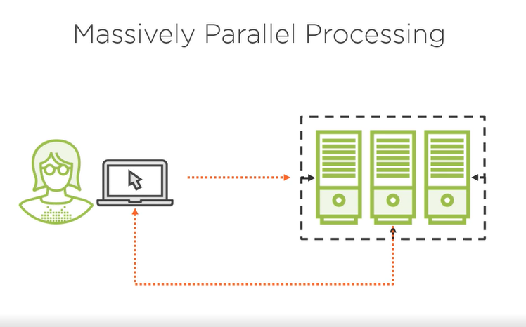
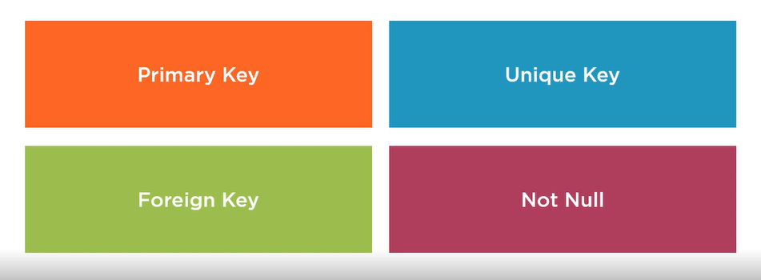

# SNOWFLAKE

- Snowflake is `fully managed` cloud data platform
- It is deployed by the vendor 
- No access to the underlying OS or hardware
- No need for ongoing component adminstration
- Cloud: AWS, Azure, GCP

## Platform

- Data Warehouse
- Data Lake
- Data Processing
- Data Sharing

## Snowflake Ecosystem

- Core Services:
    1. Virtual Warehouses: Cluster of compute resources that executes database queries and commands
    2. Snowpipe

- Tools:
    1. Web portal
    2. Command line interface - SnowSQL
    3. Connectors and drivers

- Connectors:
    1. Python
    2. Spark
    3. Kafka

- Drivers:
    1. Node.js
    2. Go
    3. .NET
    4. JDBC
    5. OBBC

- 3rd Party Applications:
    1. Power BI
    2. tableau
    3. salesforce
    4. looker

## Billing Model

1. Storage
    - It is `Flat rate per terabyte`
    - Based on `Region Payment Plan`
    - Storage Charges: `Data + Time Travel + Fail-Safe`
        - Time Travel: Enables access to data that has been changed or deleted at any point within a defined period
        - Fail-Safe: Recovery from a catastrophic incident like storage failure, corruption or security breach, It is last resource measure
        - Continuous Data Protection: Active Data(Data is active until it is changes) -> Time Travel (Records stay here for the duration of the Time Travel period(1-90 Days)) -> Automatice Fail-Safe (Records stay here for another 7 days after Time Travel Expiration)
2. Compute Resources:
    - Number and size of virtual warehouses
    - Serverless features: `Snowpipe`, `Background table mainternance`, `Database replication`
    - Cloud services: `Authentication and Authorization`, `Infrastructure management`, `Query parsing and optimization`
3. Data transfer

## Snowflake Credit:

Unit to measure to pay for compute resources
    
## Snowflake Editions:

1. Standard: 
    1. SQL data warehouse engine
    2. Encryption in transit and at rest
    3. All system tools available
    4. One day of time-travel
    
2. Enterprise
    1. Standard+
    2. Materialized views, data masking, point-lookup optimization
    3. Multi-Cluster warehouses
    4. Periodic rekey of encryption
    5. Up to 90 days of Time-Travel
        
3. Business Critical
    1. Enterprise
    2. HIPAA and PCI support
    3. Customer-Managed keys
    4. AWS and Azure Private links
    5. Disaster recovery failover and failback
    
4. Virtual Private Snowflake
    1. Business Critical+
    2. Dedicated metadata store and pool of virtual servers
    3. Isolated environment from all other snowflake accounts

## Cost

## Architecture

- Massively Parallel Processing Database Engine
    
    

- Decoupled Compute and Storage

    

- Tight integration with cloud storage

    

## Virtual Warehouse

- Operations: 

    

- Executing DDL does not always require an active Virtual Warehouse

- It has procedure for the automatic operations

- It provides the Flexibility and Elasticity

    

- Size 
    
    

- The actual monetary cost of a credit depends on the edition of your account

- Multiple Virtual Warehouses

    

- Multi-Cluster Warehouses

    

## Tables

- Table Storage
    
    
    
    1. Micro Partitions:
        1. Automatic partitioning scheme
        2. 50MB-500MB in size
        3. Compressed columnar storage
        4. Pruned during query execution
    2. Clusteting key
        1. Tables 1TB+
        2. Orderes the micro-partition records based on the key
        3. Automatically maintained by Snowflake
        4. Useful for range and equqlity predicates on the key
    3. Search Optimization Service
        1. Serverless feature
        2. Enterprise edition
        3. Table-level property

## Constaints:

Not Null is enforced

## Data Types

## Views

## Code Modules

- User Defined Functions
- External Functions
- Stored procedures
- Modules can be coded in SQL or JavaScript

## SnowSQL download

- Installation: https://docs.snowflake.com/en/user-guide/snowsql-install-config
- Run command: `snowsql -a <account-name> -u <login-name>`
- Add the account-name, username and passord in the ./snowsql/config file
  
   

